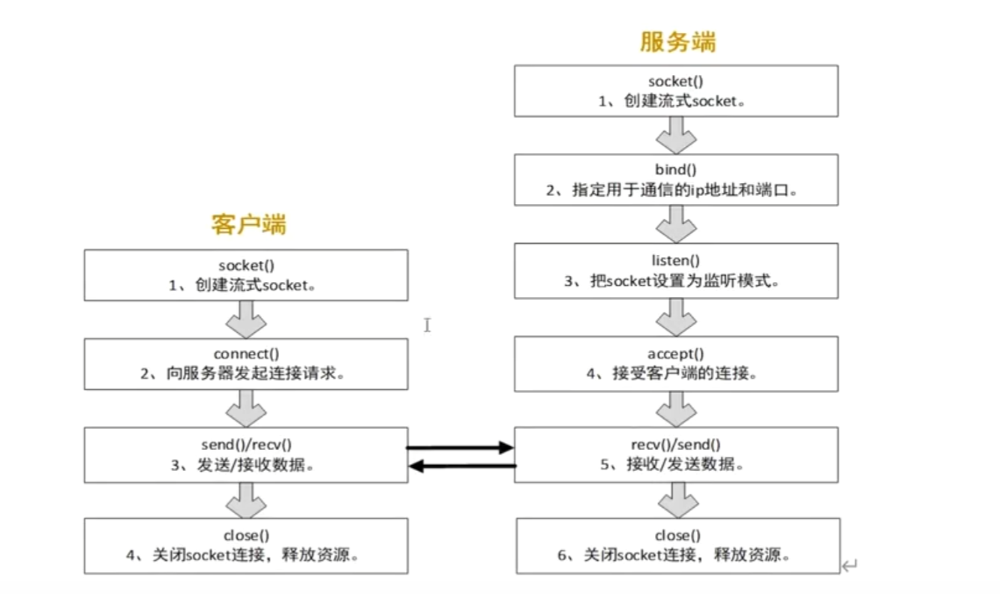

# c++网络编程练习

## 网络字节序
c语言提供了四个库函数用于主机和网络字节序的转换
ipv4地址用4字节整数表示
通讯端口用2字节整数表示
```c++
    uint16_t htons(uint16_t hostshort);2字节整数
    uint16_t htonl(uint16_t hostlong);4字节整数
    uint16_t ntohs(uint16_t netshort);
     uint16_t ntohl(uint16_t netlong);
     h 主机
     to 转换
     n network
     s short
     l long
```

向sockaddr_in 结构体成员变量填充数据时需要考虑字节序问题
